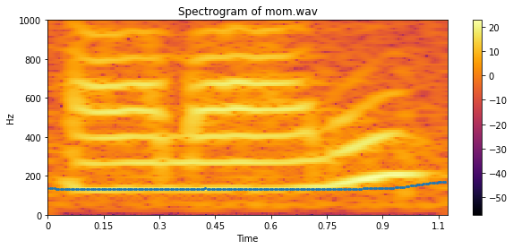

# Computer Listening (2020 Fall)

## About

Python implementations of Computer Listening class assignments

## Dependence

- Ubuntu 18.04
- Python 3.8
- numpy
- jupyterlab
- matplotlib
- librosa
- SoundFile

## Installation
 **conda environment setting**

```
conda create -n CL python=3.8
source activate CL
pip install -r requirements.txt
```

## Assignment1 : Fundamentals of DSP for Audio/Music
#### 1) Generate sinusoid waves
#### 2) Additive Synthesis - Fourier Series

#### 3) FFT Analysis
#### 4) Zero Padding
#### 5) Windowing
#### 6) STFT(Short-time Fourier Transform)

## Assignment2: Acoustic Feature Extraction
#### 1) Spectral low-level features - SC, SS, SFM, HSC, HSS)
#### 2) Spectral envelope - MFCC

#### 3) Constant-Q Transform

#### 4) Chromagram

## Assignment3: Music Analysis
#### 1) Onset Detection (time-domain, frequcney-domain, phase-based features)
#### 2) Chord Recognition using Chromagram
## Assignment4: Speech Analysis
#### 1) Pitch analysis (autocorrelation analysis)


#### 2) Formant analysis (cepstrum analysis)

## Assignment5: Linear Regression, Logistic Regression

## Assignment6: Neural Networks
